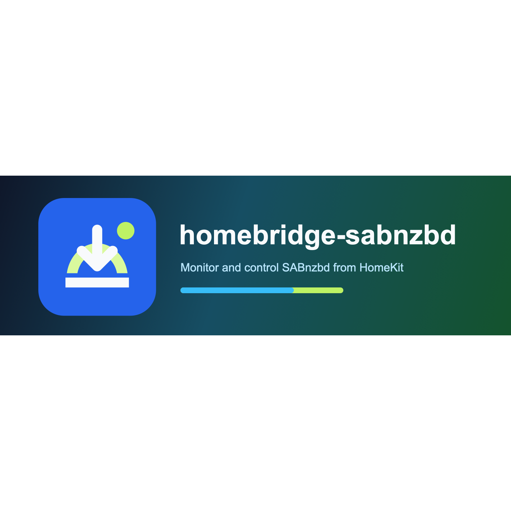

# homebridge-sabnzbd

`homebridge-sabnzbd` est un plugin Homebridge de type plateforme dynamique pour superviser et piloter une instance SABnzbd via son API HTTP JSON officielle.

## Fonctionnalites

- Supervision de la joignabilite et de l'etat du serveur.
- Pause et reprise de la file depuis Apple Maison.
- Commandes momentanées pour pause temporaire, limite de vitesse prédéfinie, vitesse normale et rafraichissement manuel.
- Commande optionnelle pour effacer les avertissements SABnzbd.
- Capteurs pour téléchargement actif, présence d'éléments en file, avertissements et dernier téléchargement en erreur.
- Services numériques pour progression de file, vitesse, espace disque libre, nombre d'éléments et échecs récents.
- Reconnexion automatique après erreur API, timeout ou perte réseau temporaire.
- Compatibilité avec le schema Homebridge Config UI X.

Les actions destructrices comme supprimer un téléchargement, purger la file, effacer l'historique, arrêter SABnzbd ou redémarrer SABnzbd ne sont volontairement pas implémentées.

## Prérequis

- Homebridge 2.x.
- Versions Node.js supportées par la version courante de Homebridge.
- SABnzbd 5.0.4 ou une autre version stable 5.x compatible.

## Installation

```bash
npm install -g homebridge-sabnzbd
```

## Configuration

Utilisez Homebridge Config UI X ou ajoutez un bloc plateforme :

```json
{
  "platform": "Sabnzbd",
  "name": "SABnzbd",
  "url": "http://sabnzbd.example:8080",
  "apiKey": "YOUR_SABNZBD_API_KEY",
  "refreshIntervalSeconds": 30,
  "timeoutMs": 10000,
  "temporaryPauseMinutes": 15,
  "speedLimitPercent": 50,
  "recentFailureWindowHours": 24,
  "clearWarningsEnabled": false
}
```

La clé API n'est jamais écrite dans les logs.

## Modélisation HomeKit

- Interrupteur principal activé : pause de la file.
- Interrupteur principal désactivé : reprise de la file.
- `Downloading` : capteur d'occupation.
- `Queue` : capteur de contact, ouvert quand la file contient des éléments.
- `Warnings` : capteur de fuite, actif quand SABnzbd signale des avertissements.
- `Last Download Failed` : capteur de mouvement.
- Les services de type capteur de luminosité exposent des valeurs numériques, car HomeKit n'a pas de type natif SABnzbd.

## Développement

```bash
npm install
npm run lint
npm test
npm run build
```

## Sources officielles

- [Documentation développeur Homebridge](https://developers.homebridge.io)
- [Template officiel Homebridge](https://github.com/homebridge/homebridge-plugin-template)
- [Exigences Homebridge Verified Plugin](https://github.com/homebridge/homebridge/wiki/verified-Plugins)
- [Référence API SABnzbd](https://sabnzbd.org/wiki/configuration/5.0/api)

## Licence

MIT
